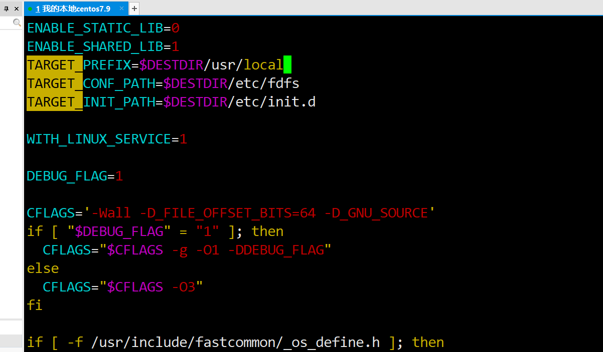
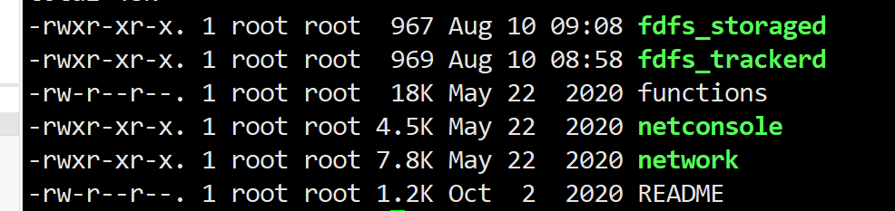
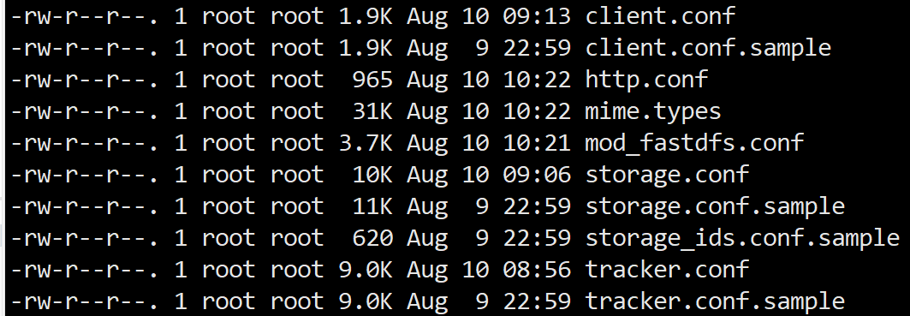
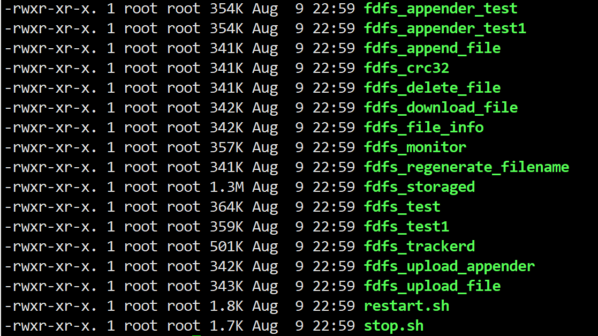
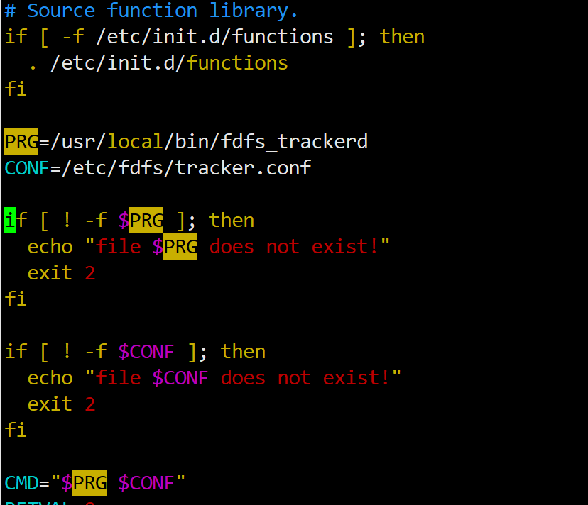
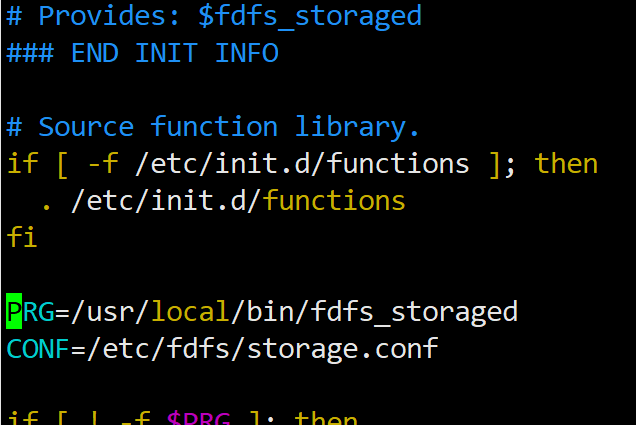
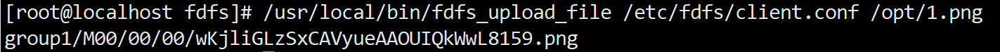
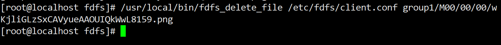
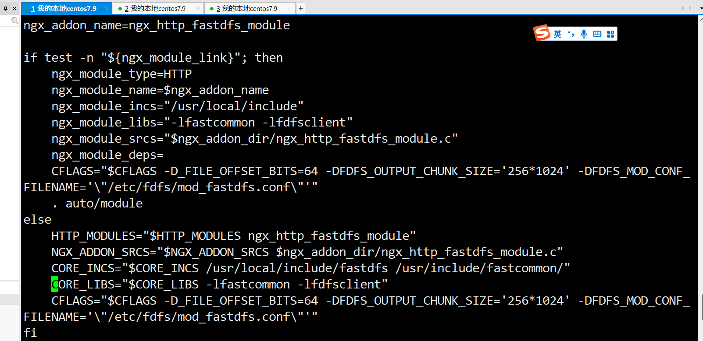

# fastDFS安装教程
https://www.pudn.com/news/6277c46277d3727348e9f271.html
首先安装依赖 cmake 
```
yum -y install cmake make gcc-c++
```

我们需要将fastdfs相关的所有东西安装到我们的 新的目录中去
```
mkdir -p /usr/local/fastdfs
```

# 安装libfastcommon库文件

解压
```
tar -zxvf libfastcommon-1.0.43.tar.gz 
```
移动位置
```
mv libfastcommon-1.0.43 /usr/local/fastdfs/
```
切换目录
```
cd /usr/local/fastdfs
```
查看
```
ll -h
```
进入这个库文件中
```
cd libfastcommon-1.0.43/

```
编译
```
./make.sh
```
安装
```
./make.sh install
```
主程序的默认目录是需要通过软连接方式修改的
创建一个软连接 快捷方式 fastdfs主程序的lib目录是在/usr/local/lib现在需要修改成我们想要设置的目录
```
ln -s /usr/lib64/libfastcommon.so /usr/local/lib/libfastcommon.so
ln -s /usr/local/lib64/libfdfsclient.so /usr/local/lib/libfdfsclient.so
ln -s /usr/local/lib64/libfdfsclient.so /usr/lib/libfdfsclient.so
```

# 安装FastDFS
先解压这个文件fastdfs-6.06.tar.gz
```
tar -zxvf fastdfs-6.06.tar.gz -C /usr/local/fastdfs/
```

默认安装的位置是在usr下面的
需要修改的话需要去修改里面的配置文件
我们在这里将默认的路径修改为/usr/local/

修改
`TARGET_PREFIX` 为图中所示的样子
但是不建议集群中这样修改软件安装的目录


保存退出
编译
```
./make.sh
```
安装
```
./make.sh install
```
这样主程序FASTDFS就安装完毕了 
可以通过
```
cd /etc/init.d
```
查看当前的服务脚本

通过
```
cd /etc/fdfs
ll -h
```
可以查看当前的fastdfs的一个配置文件

.sample表示的是配置模板 这里我们需要使用 cp 将其复制 然后修改
查看内置命令
```
cd /usr/local/bin/
ll -h
```

内置命令
# 配置一个tracker
进入配置文件中
```
cd /etc/fdfs/
```
复制并修改名称
```
cp tracker.conf.sample tracker.conf
vim tracker.conf
```
将其中的文件修改 为/fastdfs/tracker
```
base_path = /fastdfs/tracker
```
然后需要新建这个文件夹
```
mkdir -p /fastdfs/tracker
```

修改启动目录
```
cd /etc/init.d
vim fdfs_trackerd   
```
修改PRG如下图中所示（因为当前的fdfs安装在usr/local中）

启动
```
cd /etc/init.d
//   ./fdfs_trackerd {start|stop|status|restart|condrestart}
./fdfs_trackerd start
```
查看启动状态
```
./fdfs_trackerd status
```
设置默认开机启动
```
vim /etc/rc.d/rc.local
```
可以将刚才的 启动添加到其中但是注意 './'是没有的 
```
/etc/init.d/fdfs_trackerd start
```

# 配置一个Storage
```
cd /etc/init.d
```
创建并修改文件 storage.conf
```
cp storage.conf.simple storage.conf
vim storage.conf
```
需要修改
1. base_path
```
base_path = /fastdfs/storage/base
```
2. store_path
```
store_path0 = /fastdfs/storage/store
```
3. tracker_server ip表示本机ip 比如说我虚拟机用这个ip访问 就写这个ip
```
tracker_server = 192.168.229.136:22122
```
创建两个目录
```
mkdir -p /fastdfs/storage/base
mkdir -p /fastdfs/storage/store
```
修改启动文件
```
cd /etc/init.d
vim fdfs_storaged 
```
修改PRG
如下图中所示

启动
```
/etc/init.d/fdfs_storaged start
```
查看状态
```
./fdfs_storaged status
fdfs_storaged (pid 66205) is running...
```

# 配置client
并不是必须的
测试相当于是
可以跳过
这里就仅仅演示一下
放在那个服务器都可以

复制client.conf一份出来 
这个前面有命令 在这里不在赘述
```
vim client.conf
```
1.修改目录
```
base_path = /fastdfs/client
```
2.修改tracker_server
```
tracker_server = 192.168.229.136:22122
```
创建目录
```
mkdir -p /fastdfs/client
```
## 上传文件

```
/usr/local/bin/fdfs_upload_file /etc/fdfs/client.conf /opt/1.png 
```


## 删除文件
```
/usr/local/bin/fdfs_delete_file /etc/fdfs/client.conf group1/M00/00/00/wKjliGLzSxCAVyueAAOUIQkWwL8159.png
```

没有输出表示删除成功
# 安装nginx
安装nginx需要的依赖
```
yum install -y gcc-c++ make automake autoconf libtool pcre-devel zlib zlib-devel openssl openssl-devel
```
## 安装fastdfs_nginx_module 
```
tar -zxvf fastdfs-nginx-module-1.22.tar.gz -C /usr/local/fastdfs/
```
进入这目录中
修改配置文件
```
cd /usr/local/fastdfs/fastdfs-nginx-module-1.22/src
vim config
```

修改其中的
```
CORE_INCS="$CORE_INCS /usr/local/include/fastdfs /usr/include/fastcommon/"
```
## 开始安装nginx 

解压
```
tar -zxvf nginx-1.16.1.tar.gz /usr/local/fastdfs/
```

创建一个文件夹
```
mkdir -p /var/temp/nginx
```

切换到nginx
```
cd /usr/local/nginx***
```


配置下nginx默认安装目录（没有这个东西无法添加模块）

```
./configure \
--prefix=/usr/local/nginx \
--pid-path=/var/run/nginx/nginx.pid \
--lock-path=/var/lock/nginx.lock \
--error-log-path=/var/log/nginx/error.log \
--http-log-path=/var/log/nginx/access.log \
--with-http_gzip_static_module \
--http-client-body-temp-path=/var/temp/nginx/client \
--http-proxy-temp-path=/var/temp/nginx/proxy \
--http-fastcgi-temp-path=/var/temp/nginx/fastcgi \
--http-uwsgi-temp-path=/var/temp/nginx/uwsgi \
--http-scgi-temp-path=/var/temp/nginx/scgi \
--add-module=/usr/local/fastdfs/fastdfs-nginx-module-1.22/src
```
编译
```
make
```
安装
```
make install
```

## 配置nginx
```
cd /usr/local/fastdfs/fastdfs-nginx-module-1.22/src/
cp mod_fastdfs.conf /etc/fdfs/
cd /etc/fdfs/
vim /mod_fastdfs.conf
```
1.tracker_server
```
tracker_server=192.168.229.136:22122
```
2. url_have_group_name(是否包含group名称)
```
url_have_group_name = true
```
3.store_path0
```
store_path0=/fastdfs/storage/store
```
保存退出

### HTTPconf
```
cp /usr/local/fastdfs/fastdfs-6.06/conf/http.conf  /etc/fdfs/
cp /usr/local/fastdfs/fastdfs-6.06/conf/mime.types  /etc/fdfs/
```
### 创建软连接
创建启动链接
nginx启动后，会在默认的/usr/lib64目录中查找需要的so文件。如果在安装FastDFS时，修改了make.sh文件中的TARGET_PREFIX参数，则必须创建此软连接
```
ln -s /usr/local/lib64/libfdfsclient.so /usr/lib64/libfdfsclient.so
```
创建网络访问存储服务的软连接
在上传文件到 FastDFS 后，FastDFS 会返回group1/M00/00/00/xxxxxxxxxx.xxx。其中 group1 是卷名，在mod_fastdfs.conf 配置文件中已配置了 url_have_group_name ，以保证URL解析正确。而其中的 M00 是FastDFS保存数据时使用的虚拟目录，需要将这个虚拟目录定位到真实数据目录上。

```
ln -s /fastdfs/storage/store/data/ /fastdfs/storage/store/data/M00
```
### 修改nginx配置文件
```    
vim /usr/local/nginx/conf/
```
```
1.
user root; # Nginx 需要访问 linux文件系统，必须有文件系统的权限。User root代表nginx 访问文件系统的权限
是root用户权限。如果不开启权限，可能有404访问错误。
2.
    server {
        listen       8888;#端口号
        server_name  localhost;
        #代理配置
        location ~group[0-9]/M00{
                ngx_fastdfs_module;
        }

        #charset koi8-r;

        #access_log  logs/host.access.log  main;

        location / {
            root   html;
            index  index.html index.htm;
        }

```
启动nginx
```
cd /usr/local/nginx/sbin
./nginx 
```


